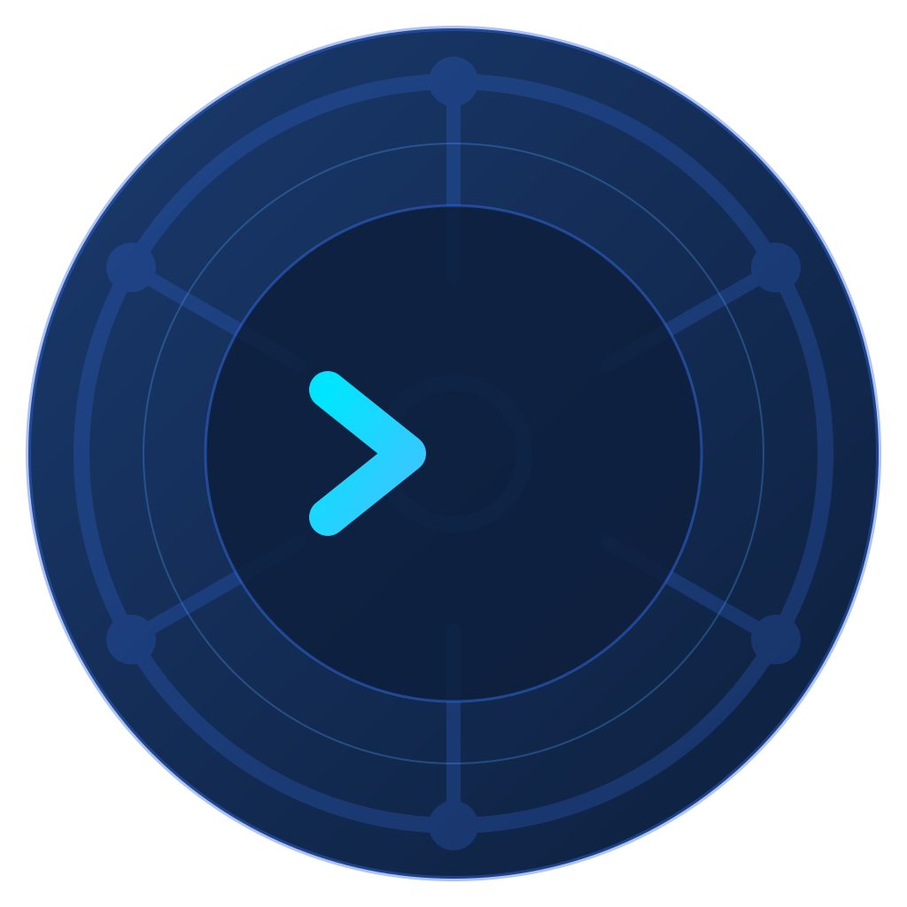
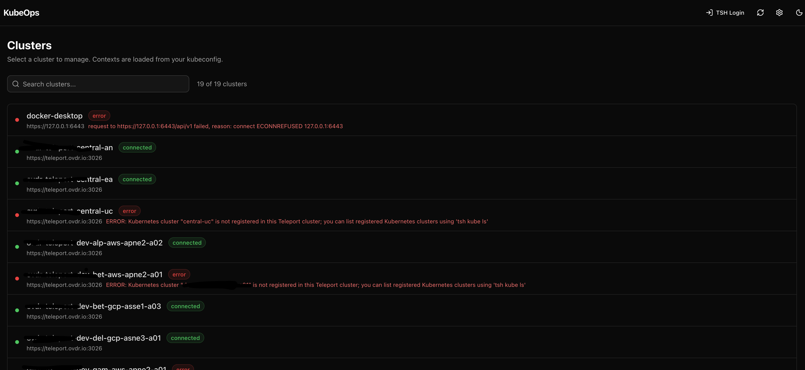
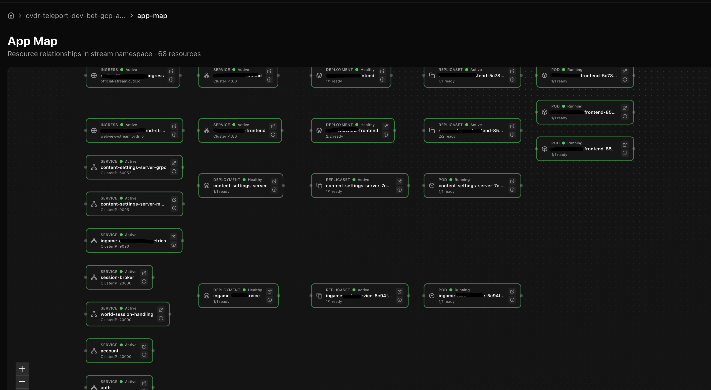
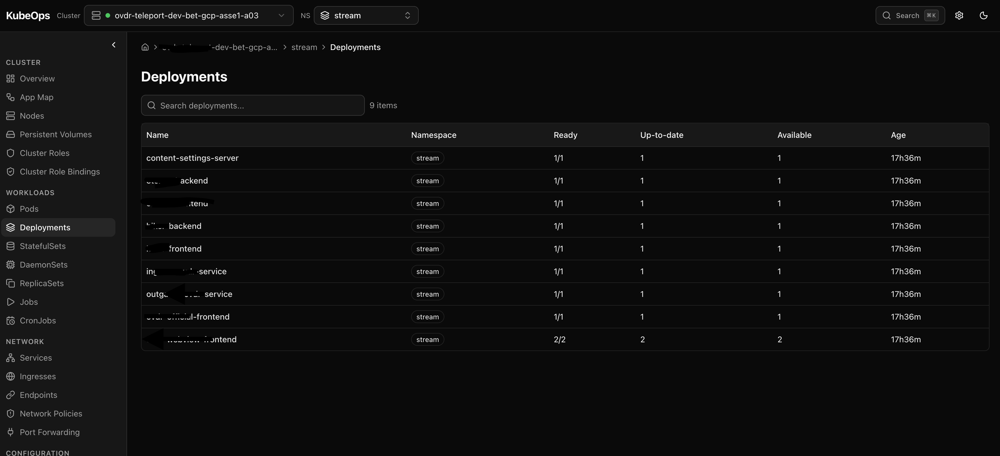
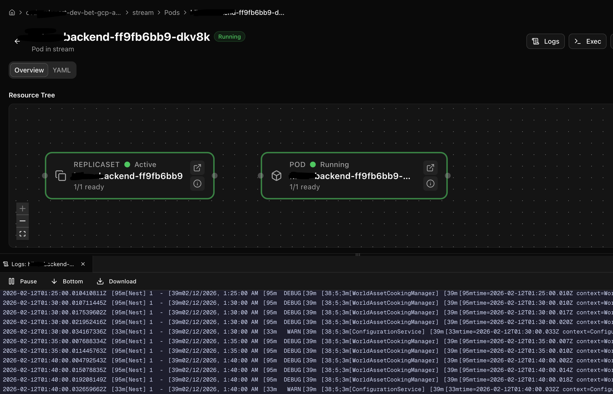
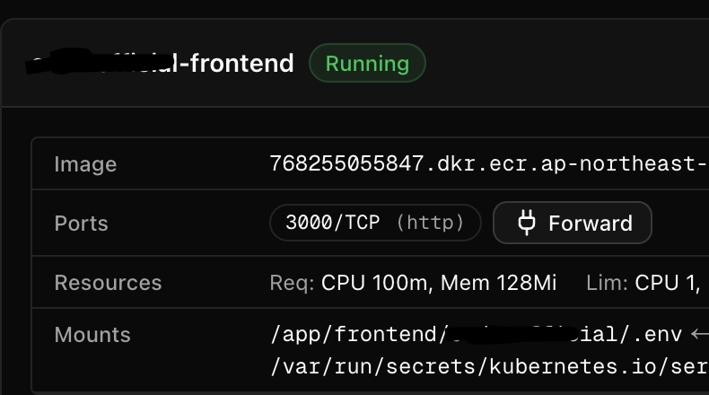
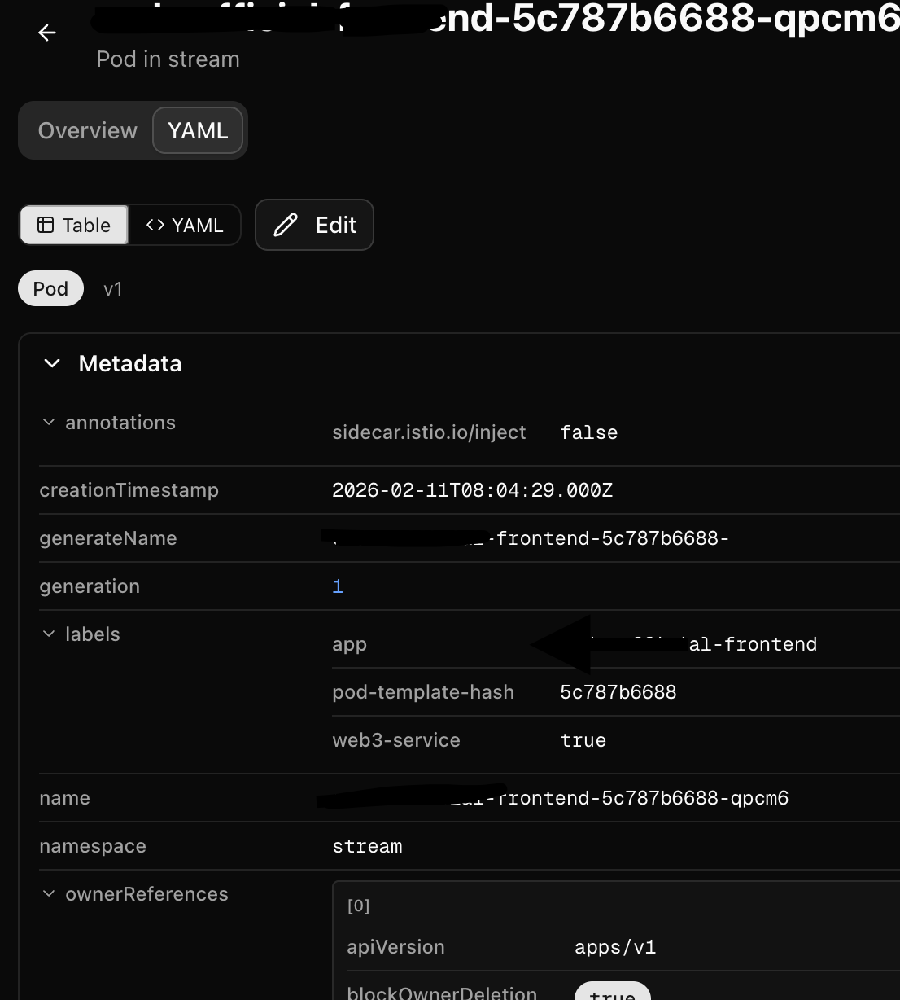
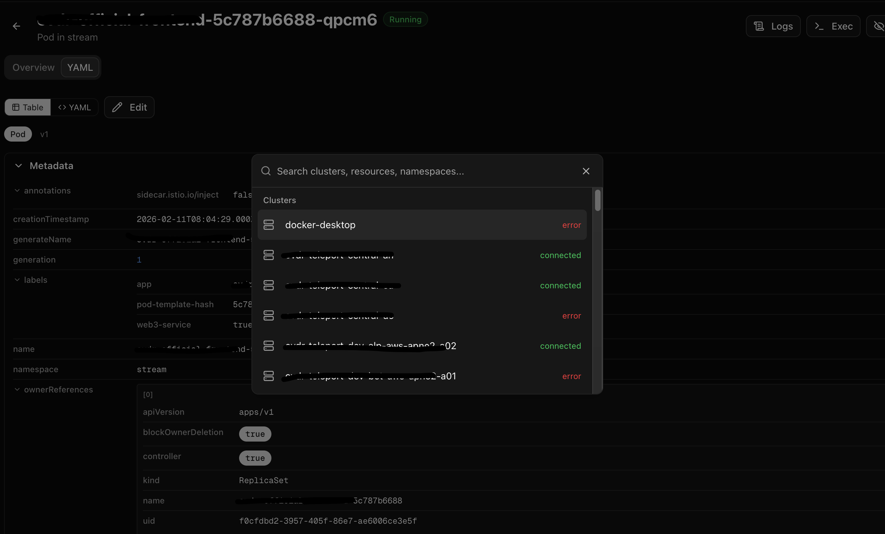
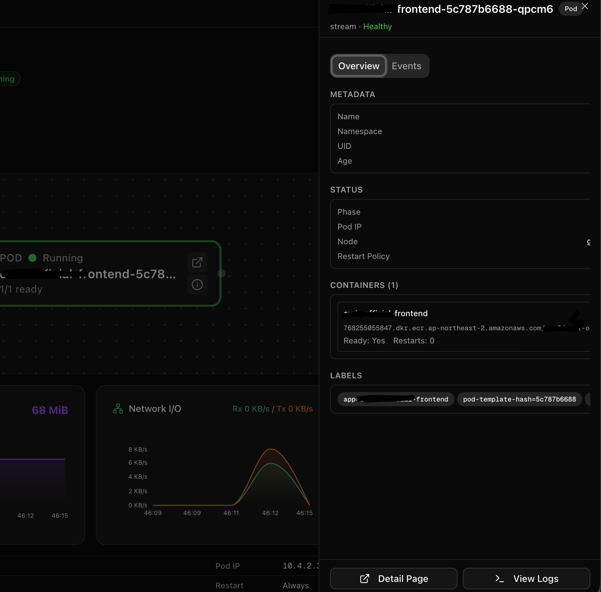

<p align="center">
  
</p>

<h1 align="center">KubeOps</h1>

<p align="center">
  A modern desktop client for Kubernetes — navigate clusters, debug pods, and manage workloads with a visual interface.
</p>

<p align="center">
  
  
  
  
  
  <a href="https://github.com/trustspirit/kubeops/releases/latest"></a>
  <a href="https://www.npmjs.com/package/kubeops"></a>
</p>

---

## Download

Download the latest version for your platform from the **[Releases](https://github.com/trustspirit/kubeops/releases/latest)** page.

| Platform              | File                          |
| --------------------- | ----------------------------- |
| macOS (Apple Silicon) | `KubeOps-{version}-arm64.dmg` |
| macOS (Intel)         | `KubeOps-{version}-x64.dmg`   |
| Linux                 | `KubeOps-{version}.AppImage`  |
| Windows               | `KubeOps-{version}.exe`       |

> The app supports auto-update after installation.

### Requirements

- **kubectl** installed and available on your `PATH`
- A valid `~/.kube/config` with at least one cluster context
- *(Optional)* `metrics-server` in the cluster for CPU/memory charts
- *(Optional)* Prometheus for network I/O and filesystem charts
- *(Optional)* `tsh` CLI for Teleport-managed clusters

---

## Why KubeOps?

There are many Kubernetes tools out there. Here's how KubeOps compares:

| | KubeOps | Lens | k9s | K8s Dashboard |
| --- | :---: | :---: | :---: | :---: |
| Free & open source | **Yes** | Paid plans | Yes | Yes |
| Visual resource topology | **Yes** | No | No | Limited |
| Built-in terminal & logs | **Yes** | Yes | Yes | Logs only |
| Real-time metrics & charts | **Yes** | Yes (paid) | Basic | Basic |
| Desktop app (no server install) | **Yes** | Yes | Terminal | Needs deploy |
| Zero config (reads kubeconfig) | **Yes** | Yes | Yes | Needs deploy |
| CRD browser | **Yes** | Extension | Yes | Limited |
| Teleport auth | **Yes** | No | No | No |

### In short

- **Free forever** — No subscriptions, no feature gates, no telemetry. MIT licensed.
- **Visual-first** — Interactive App Map shows how Ingresses, Services, Deployments, and Pods connect. Not just resource lists.
- **All-in-one desktop app** — Terminal, logs, port forwarding, metrics charts, YAML editor in a single window. No server to deploy, no browser extension to install.
- **Modern & lightweight** — Fast startup, small footprint. No Electron bloat from bundled IDE features you don't need.
- **30+ resource types** — Pods, Deployments, StatefulSets, DaemonSets, CronJobs, Services, Ingresses, ConfigMaps, Secrets, CRDs, and more.
- **Cross-platform** — Runs natively on macOS, Windows, and Linux with auto-update.

---

## Features

### Cluster Overview Dashboard

Auto-detects all clusters from kubeconfig. Select a cluster to see node/pod counts, pod status distribution, workload health, CPU usage per node, active services with port-forward buttons, ingress endpoints, and recent warning events.

<!-- Screenshot: Cluster Overview -->



### App Map (Resource Topology)

Interactive flowchart visualizing resource relationships: Ingress → Service → Deployment → ReplicaSet → Pod. Auto-layout with pan, zoom, and fit-to-view. Each node shows kind, name, health status, and summary info with Detail and Info action buttons.

<!-- Screenshot: App Map -->



### Live Status Display

Every resource list features searchable, sortable tables with health status badges and relative age display. Warnings and unhealthy states (CrashLoopBackOff, ImagePullBackOff, OOMKilled) are highlighted and surfaced first.

<!-- Screenshot: Resource List -->



### Pod Terminal & Logs

A resizable bottom panel supports multiple concurrent sessions as tabs. Full PTY-based terminal via `kubectl exec` with keyboard input and resizing. Real-time log streaming with pause/follow toggle, jump-to-bottom, and download. Sessions persist across page navigation.

<!-- Screenshot: Terminal & Logs -->



### Port Forwarding

Start port forwards from pod container ports, service ports, or YAML editor fields. Manage all active forwards from the Port Forwarding page — view status (starting / active / error), open in browser, or stop individually.

<!-- Screenshot: Port Forwarding -->



### YAML Editor (Table / YAML / Edit)

Three viewing modes for every resource manifest:

- **Table view** — Structured, collapsible sections with smart value rendering
- **YAML view** — Read-only formatted output
- **Edit mode** — Syntax-highlighted editor with validation, save with `Cmd+S`

<!-- Screenshot: YAML Editor -->



### Command Palette

Press `Cmd+K` (or `Ctrl+K`) to open a fuzzy-search palette. Quickly jump to clusters (with connection status), namespaces, or any resource type.

<!-- Screenshot: Command Palette -->



### Resource Info Drawer

Click the info icon on any App Map node to open a right-side drawer with Overview (metadata, status, labels), Events (sorted by severity with warning highlights), and footer actions to navigate to detail pages or open logs.

<!-- Screenshot: Resource Info Drawer -->



### Deployment Scaling

Scale Deployments and StatefulSets directly from the UI. A dedicated scale dialog lets you set the desired replica count and apply it instantly.

### Custom Resource Definitions (CRDs)

Browse cluster-installed CRDs and their instances. The sidebar lists discovered CRD groups, and each instance supports the same Table / YAML / Edit views as built-in resources.

### Dark / Light Mode

Toggle between dark and light themes from the header. Powered by `next-themes` with system preference detection. Your choice persists across sessions.

### Teleport Authentication

For clusters behind [Teleport](https://goteleport.com/), KubeOps detects Teleport contexts and provides a built-in login flow via `tsh kube login` — no manual terminal steps required.

### Pod Restart Watcher

Enable Watch on any pod to monitor restart counts in the background. Polls every 10 seconds and sends desktop notifications when restarts increase. Watched pods persist across sessions.

### Auto-Update

An update indicator in the header shows the current state: checking → available → downloading → ready to install. Updates are downloaded in the background and applied on the next restart.

---

## Development

### Run from Source

```bash
git clone https://github.com/trustspirit/kubeops.git
cd kubeops
npm install          # Node.js v18+ required
npm run electron:dev
```

The app opens automatically once the dev server is ready (port 51230).

### Build

Create a distributable package for your platform:

| Platform | Command                        |
| -------- | ------------------------------ |
| macOS    | `npm run electron:build:mac`   |
| Windows  | `npm run electron:build:win`   |
| Linux    | `npm run electron:build:linux` |

Output is written to `dist-electron/`.

---

## Keyboard Shortcuts

| Shortcut           | Action                 |
| ------------------ | ---------------------- |
| `Cmd+K` / `Ctrl+K` | Open command palette   |
| `Cmd+S` / `Ctrl+S` | Save YAML in edit mode |

---

## Error Logs

KubeOps automatically captures errors and writes them to a log file so you can diagnose issues even without DevTools.

**What gets logged:**

- Main process crashes (uncaught exceptions, unhandled rejections)
- Renderer process crashes and `console.error()` output
- Production server stderr and unexpected exits
- Startup failures

**Log location:**

| Platform | Path                                                   |
| -------- | ------------------------------------------------------ |
| macOS    | `~/Library/Application Support/KubeOps/logs/error.log` |
| Windows  | `%APPDATA%\KubeOps\logs\error.log`                     |
| Linux    | `~/.config/KubeOps/logs/error.log`                     |

**Accessing logs from the app:**

Use the **Help** menu:

| Menu Item         | Action                                         |
| ----------------- | ---------------------------------------------- |
| Open Error Log    | Opens the log file in your default text editor |
| Show Log Folder   | Opens the log directory in Finder / Explorer   |
| Export Error Log… | Save a copy to a location of your choice       |

Logs rotate automatically at 5 MB (previous log kept as `error.log.old`).

---

## Supported Resources

KubeOps provides full browse / detail / YAML / edit support for 30+ Kubernetes resource types:

| Category        | Resources                                                      |
| --------------- | -------------------------------------------------------------- |
| Workloads       | Pods, Deployments, StatefulSets, DaemonSets, ReplicaSets, Jobs, CronJobs |
| Network         | Services, Ingresses, Endpoints, Network Policies               |
| Config          | ConfigMaps, Secrets, Service Accounts                          |
| Storage         | Persistent Volumes, Persistent Volume Claims                   |
| Access Control  | Roles, Role Bindings, Cluster Roles, Cluster Role Bindings     |
| Cluster         | Nodes, Namespaces, Events                                      |
| Custom          | Any installed CRD and its instances                            |

---

## Troubleshooting

| Problem                   | Solution                                                                    |
| ------------------------- | --------------------------------------------------------------------------- |
| macOS Gatekeeper warning  | See [macOS Gatekeeper](#macos-gatekeeper) below                             |
| "No clusters found"       | Verify `~/.kube/config` is valid — run `kubectl config get-contexts`        |
| Connection refused        | Restart the app or check if port 51230 is in use                            |
| Metrics charts empty      | Ensure `metrics-server` is installed in the cluster                         |
| Network/FS charts missing | Requires Prometheus with `container_network_*` and `container_fs_*` metrics |
| Port forward fails        | Check that `kubectl` is on your PATH and the target pod is running          |
| Teleport login fails      | Ensure `tsh` is installed and on your PATH                                  |
| Diagnosing crashes        | Open **Help → Open Error Log** to see captured errors                       |

### macOS Gatekeeper

Because the app is not yet code-signed with an Apple Developer certificate, macOS may show:

> "KubeOps.app" cannot be opened because the developer cannot be verified.

**Option A — System Settings (recommended)**

1. Open **System Settings → Privacy & Security**
2. Scroll down to find the blocked message for KubeOps
3. Click **Open Anyway**

**Option B — Terminal**

```bash
xattr -cr /Applications/KubeOps.app
```

---

## License

[MIT](LICENSE)
