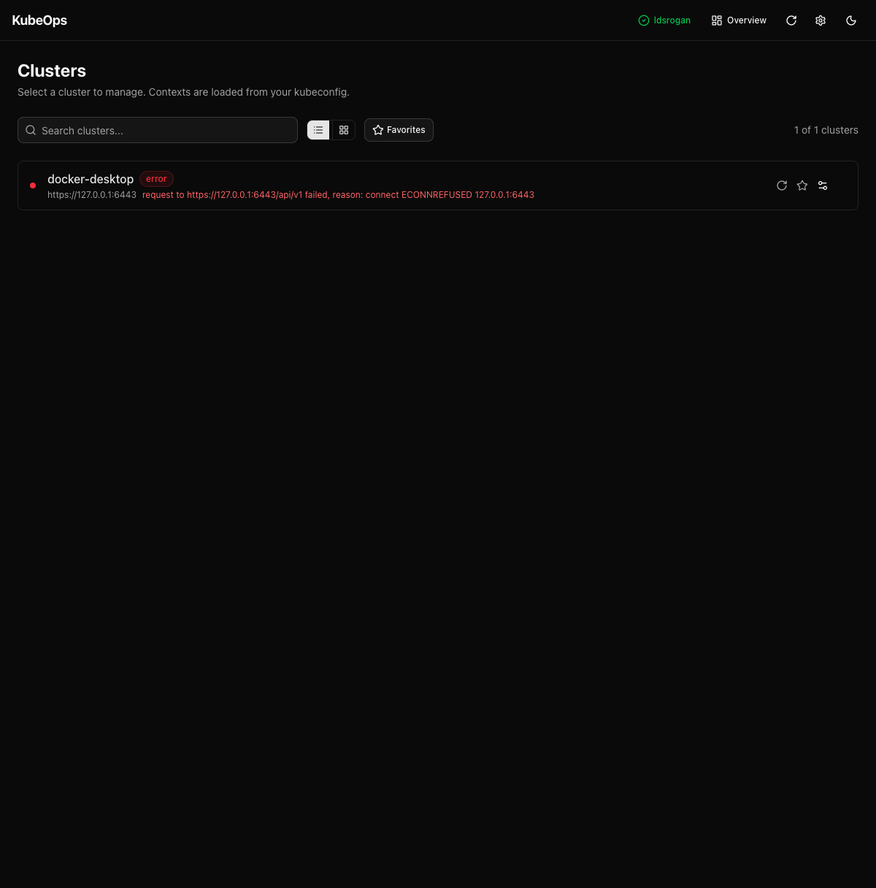
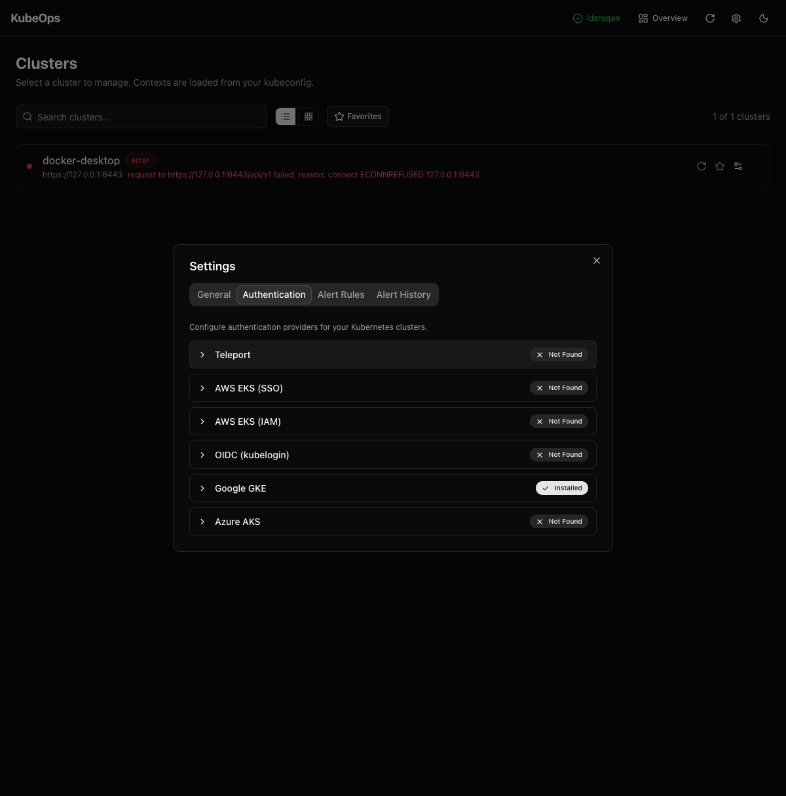
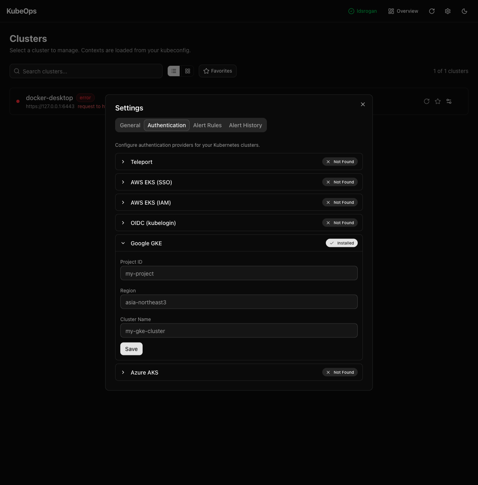

# v0.3.0 — Multi-Provider Authentication

## Highlights

KubeOps now supports **6 authentication providers** out of the box. No more switching to the terminal to re-authenticate — KubeOps detects your cluster's auth provider from kubeconfig and handles login directly.

### Supported Providers

| Provider | CLI | What it does |
|----------|-----|-------------|
| **Teleport** | `tsh` | Proxy login + per-cluster `kube login` |
| **AWS EKS (SSO)** | `aws` | SSO browser login + kubeconfig update |
| **AWS EKS (IAM)** | `aws` / `aws-iam-authenticator` | Credential verification |
| **OIDC** | `kubelogin` | Browser-based OIDC token refresh |
| **Google GKE** | `gcloud` | Google auth + cluster credentials |
| **Azure AKS** | `az` | Azure login + AKS credentials |

## What's New

### Multi-Provider Auth Framework
- **Auto-detection**: Analyzes kubeconfig `exec` commands and server URLs to identify which provider manages each cluster
- **Unified Settings**: New **Authentication** tab in Settings shows all providers with install status and configuration fields
- **Header login buttons**: Only installed providers appear in the header, showing logged-in username when authenticated
- **Provider-aware cluster login**: Clicking a disconnected cluster routes to the correct provider automatically
- **Provider-aware error recovery**: Auth error pages show a login button for the detected provider

### Architecture
- Provider-per-module pattern with common `AuthProvider` interface
- Unified API routes (`/api/auth/[providerId]/status`, `/api/auth/[providerId]/login`)
- Safe CLI execution via `execFileSync` (no shell injection)
- Input validation on all API endpoints
- Legacy `/api/tsh/*` routes preserved for backward compatibility

## Screenshots

### Cluster page with provider login status


### Authentication providers in Settings


### Provider-specific configuration


## Breaking Changes

- The Teleport (tsh) configuration has moved from **Settings > General** to **Settings > Authentication**. Existing settings are preserved in localStorage.

## Requirements

No new required dependencies. Auth providers are optional — install the CLI tools for the providers you use:

```bash
# AWS EKS
brew install awscli

# Google GKE
brew install google-cloud-sdk

# Azure AKS
brew install azure-cli

# OIDC
kubectl krew install oidc-login

# Teleport
brew install teleport
```
